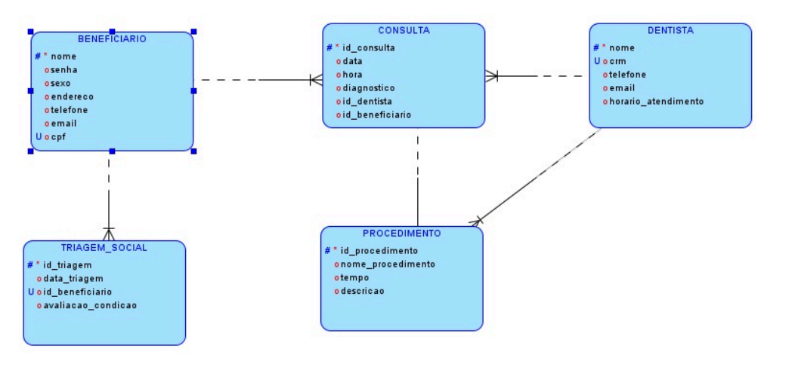
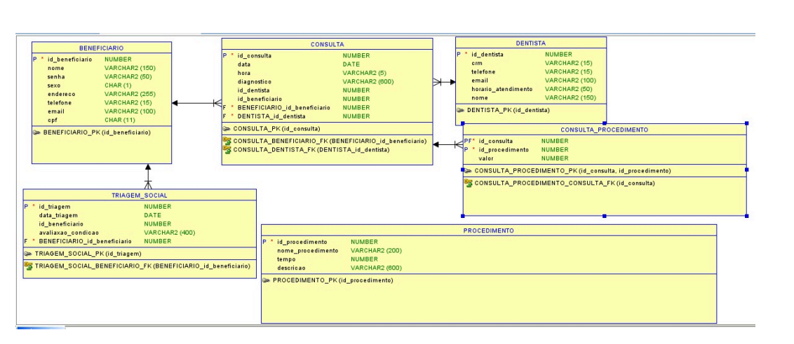

# Banco de Dados e Relatórios SQL — Projeto Acadêmico

## Sobre o projeto

Este projeto acadêmico consiste na modelagem, implementação e consulta de um banco de dados para um sistema de atendimento odontológico voltado a beneficiários que não possuem condições financeiras para realizar tratamentos odontológicos.

O projeto foi desenvolvido com o objetivo de organizar informações sobre beneficiários, triagens sociais, dentistas, consultas e procedimentos odontológicos, permitindo o armazenamento, relacionamento e consulta dos dados por meio de SQL.

Além da modelagem do banco de dados, foram desenvolvidos comandos e consultas SQL para manipulação, organização e análise das informações.

## Objetivo

O objetivo do projeto é desenvolver uma estrutura de banco de dados capaz de armazenar e relacionar as principais informações do sistema de atendimento odontológico.

Também foram desenvolvidas consultas SQL para gerar informações e relatórios a partir dos dados armazenados, utilizando diferentes recursos da linguagem SQL.

# Entidades e suas funções

## Beneficiário

É o principal usuário do sistema.

Armazena informações pessoais e de identificação, incluindo:

* Nome
* Senha
* Sexo
* Endereço
* Telefone
* E-mail
* CPF
* Gravidade do caso

O CPF permite a identificação única do beneficiário, enquanto a gravidade do caso auxilia na priorização dos atendimentos.

## Triagem Social

Registra a avaliação inicial da condição social do beneficiário.

Essas informações permitem compreender a situação social de cada beneficiário e auxiliar na priorização dos casos mais urgentes.

## Dentista

Armazena as informações dos profissionais responsáveis pelos atendimentos odontológicos.

Entre os dados registrados estão:

* Nome
* CRM
* Telefone
* E-mail
* Horário de atendimento

## Consulta

Registra os atendimentos realizados pelos dentistas.

São armazenadas informações como:

* ID da consulta
* Data e hora
* Motivo da consulta
* Diagnóstico
* Beneficiário
* Dentista

As consultas permitem manter um histórico dos atendimentos realizados.

## Procedimentos Odontológicos

Representa os procedimentos que podem ser realizados durante os atendimentos.

São armazenados dados como:

* ID do procedimento
* Nome do procedimento
* Descrição
* Tempo estimado

Os procedimentos permitem organizar os serviços disponíveis e relacioná-los às consultas realizadas.

## Custos e realizações

A relação entre consultas e procedimentos permite identificar quais procedimentos foram realizados em cada atendimento e possibilita o controle dos custos envolvidos.

# Regras de negócio

O sistema foi desenvolvido considerando as seguintes regras de negócio:

* Cada beneficiário possui sua própria triagem social.
* O CPF identifica unicamente cada beneficiário.
* Um dentista pode atender vários beneficiários.
* Um beneficiário pode possuir várias consultas.
* Cada consulta está relacionada a um beneficiário e a um dentista.
* Uma consulta pode envolver diferentes procedimentos odontológicos.
* Os procedimentos realizados são relacionados às respectivas consultas.
* A gravidade do caso auxilia na priorização dos beneficiários.

# Modelagem do Banco de Dados

## DER — Diagrama Entidade-Relacionamento

O DER apresenta as entidades, atributos e relacionamentos utilizados na estruturação do banco de dados.

## MER — Modelo Entidade-Relacionamento

O MER representa as entidades e seus relacionamentos de acordo com as regras de negócio definidas para o sistema.

## Diagrama de Classes

O diagrama de classes representa a estrutura das principais classes e seus relacionamentos no sistema.

---

# SQL desenvolvido

O projeto também conta com comandos e consultas SQL para criação, manipulação e consulta dos dados.

Os scripts foram organizados de acordo com os conteúdos trabalhados no projeto.

### CREATE e DROP TABLE

Comandos utilizados para criação e remoção das tabelas do banco de dados.

### INSERT

Utilizado para inserir registros nas tabelas.

### UPDATE e DELETE

Utilizados para atualizar e excluir registros existentes.

### Funções numéricas e simples

Utilização de funções SQL para realizar operações e tratamentos sobre os dados.

### GROUP BY

Utilizado para agrupar registros e gerar informações consolidadas.

### JOIN

Utilizado para relacionar informações de diferentes tabelas.

### ORDER BY

Utilizado para ordenar os resultados das consultas.

### Subqueries

Utilização de subconsultas, também conhecidas como subqueries, para realizar consultas dentro de outras consultas.

# Conhecimentos aplicados

* SQL
* Banco de Dados Relacional
* Modelagem de Dados
* DER
* MER
* Diagrama de Classes
* CREATE TABLE
* DROP TABLE
* INSERT
* UPDATE
* DELETE
* JOIN
* GROUP BY
* ORDER BY
* Subqueries
* Funções SQL
* Consultas e relatórios

# Projeto acadêmico

Projeto desenvolvido academicamente com foco em modelagem de banco de dados, implementação utilizando SQL e desenvolvimento de consultas e relatórios para análise das informações armazenadas.
